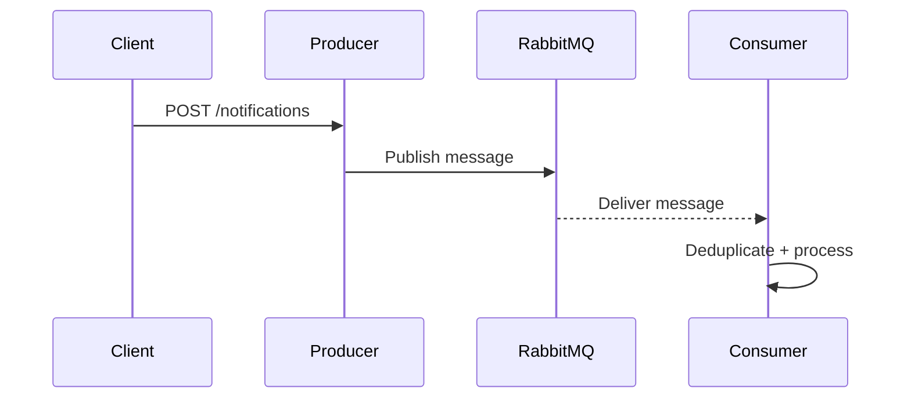

# async-notifications

Producer and consumer Spring Boot applications connected via RabbitMQ.

## What this demonstrates
- Async messaging with retries and DLQ
- Idempotency handling and documentation
- Clear service boundaries and run instructions

## Architecture sequence


## Run locally
```bash
cd async-notifications
cp ../.env.example .env

docker compose --env-file .env up -d
../mvnw -pl async-notifications/producer-app spring-boot:run
../mvnw -pl async-notifications/consumer-app spring-boot:run
```

## Curl examples
```bash
curl -X POST http://localhost:8091/notifications \
  -H "Content-Type: application/json" \
  -d '{"recipient":"user@example.com","message":"Hello"}'
```

## Idempotency note
This demo uses in-memory deduplication with a 10-minute TTL. In production, use a durable store (e.g., Redis with TTL or a relational table) to ensure cross-instance deduplication and crash recovery.

## DLQ strategy
Messages that fail processing after retries are routed to `notifications.dlq`. Inspect via RabbitMQ management UI (`http://localhost:15672`).
