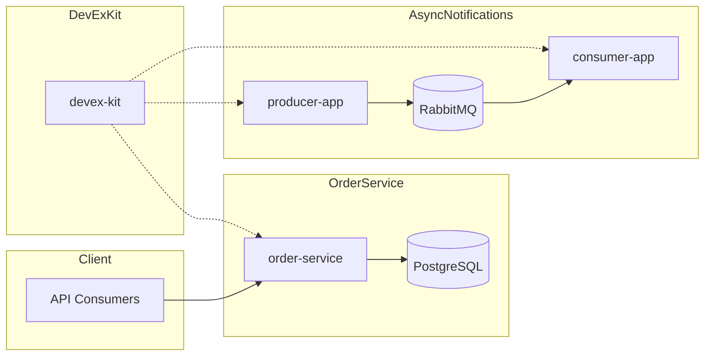

# Architecture Overview

This repository showcases three production-shaped projects: a RESTful order service, an asynchronous notification system, and a DevEx standards kit. Each module demonstrates operational maturity, clear layering, and consistency in delivery practices.

## System diagram

## Architectural tenets
- Layered code boundaries (controller → service → repository).
- Externalized configuration for local and production parity.
- Operational readiness: observability, health checks, and test coverage.
